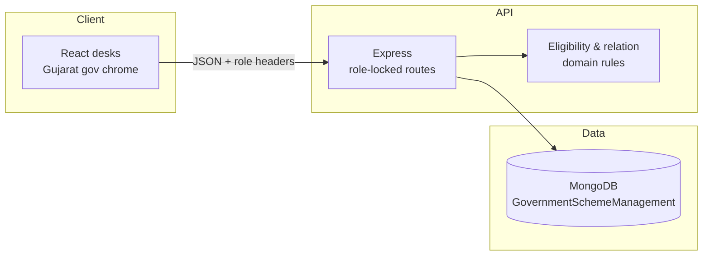

# Gujarat Family ID — Beneficiary & Scheme Desk

One household register. One place to announce welfare schemes. Eligibility that comes from the register, not from a new form every time.

This prototype is a walk-in **Family ID** desk for Gujarat: a Registry Officer keeps the household true after seeing proofs, the Family Head applies only where the house (or a member) is eligible, and each scheme has its own officer desk so applications do not get mixed across departments.

It is built as a citizen-services prototype (Gujarat e-governance look), not a marketing site. It is **not** an official Government of Gujarat portal. IDs are not Aadhaar. There is no Ashoka emblem.

---

## What it provides

| Capability | Why it matters |
|---|---|
| **One Family ID for the household** (`GJ-F-…`) | Food, scholarship, pension, and widow support all point at the same house instead of four different lists. |
| **One Member ID for life** (`GJ-M-…`) | Marriage moves the person to another house. It does not mint a new person. |
| **Walk-in register only** | The family cannot edit itself. Birth, marriage, and death are committed at the counter with a proof note. |
| **Eligibility from the register** | Age, gender, widow status, and household vs person are computed on the server. The Head sees Eligible / Not eligible / Already receiving. |
| **Family schemes vs person schemes** | Ration is one application for the Family ID. A scholarship or pension is one living member. |
| **A desk per announced scheme** | Publishing a scheme issues that scheme’s officer login. That officer sees only that scheme’s applications. A Scheme Manager can still see every scheme. |
| **Anti-duplicate apply** | The same house or member cannot hold two open applications (or two enrolments) for the same scheme. |

---

## Who uses it, and what they can do

Four desks, one login page. Each session is a single role — there is no role switcher.

### Family Head (citizen)

Signs in with the **Family ID** and household password.

- Sees only their **ACTIVE** household (names, Member IDs, relation to head — relation is computed, not stored as a stale label).
- Browses announced schemes and the short citizen summary.
- Applies for a **whole-household** scheme in one click, or picks an eligible member for a **person** scheme.
- Tracks applications: pending, approved, rejected.
- **Cannot** change the register, create schemes, or approve anyone.

To add a child, record a marriage, or record a death, the family comes to the office with proofs.

### Registry Officer

The counter that owns truth.

- Registers a new family (head + members) and issues Family ID + Member IDs.
- Records **birth**, **marriage** (wife joins by Member ID; the natal house is closed `MARRIAGE_OUT`, the husband’s house opens `MARRIAGE_IN`), and **death** (including succession of head).
- Looks up a household by Family ID or member.
- Every mutation stores officer id + a typed proof note. History is left in place (`LEFT` + `closedHow`). Rows are not deleted.

### Scheme Creator (government)

Announces a scheme the way a notice is written, not as a database dump.

1. Name, department, and what the citizen gets.
2. Who may apply: **whole household** or **one person**.
3. Person rules (age, gender, widow) only when the benefit is for one member.

Publishing the scheme also creates that scheme’s officer username and password. They appear on the creator list and on the login page for this prototype.

### Scheme Officer and Scheme Manager

- **Scheme Officer** (`so.…` logins): inbox, approve / reject, beneficiaries, and read-only family verify — **for one scheme only**. Another scheme’s applications are not visible and cannot be decided.
- **Scheme Manager** (`scheme.officer`): the same tools across **all** schemes.

Approve writes a beneficiary row. Reject requires a note.

---

## How work moves through the system

```text
Registry Officer          Scheme Creator              Family Head              Scheme Officer
registers / updates  →    announces scheme      →    applies if eligible  →   verifies & decides
the household             (+ issues that                                  enrols beneficiary
                          scheme’s desk login)
```

1. The house exists on the register (seeded Patel household `GJ-F-48291753`, or a newly registered family).
2. Government publishes a scheme with department and who may apply.
3. The Head opens યોજના / Schemes; the API marks each scheme Eligible or not from the live register.
4. The Head applies (`GJ-A-…`).
5. The matching scheme desk (or the manager) verifies the household and approves or rejects.

---

## Architecture



| Layer | Choice |
|---|---|
| Web | React (JavaScript) + Vite + CSS styled as a Digital Gujarat–style citizen desk |
| API | Node.js + Express, layered as routes → controllers → services → models |
| Rules | Domain functions for eligibility and relation-to-head (not columns that go stale) |
| Database | MongoDB — Atlas for the live cluster; Docker Mongo remains an optional local fallback |
| Auth (this version) | Login issues a session; the API checks `X-Role` / `X-Family-Id` / `X-Officer-Id`. Head password is hashed on the family. Per-scheme officer desks are stored in Mongo. JWT is not in this slice. |

Write locks stay with the API: Registry writes people and houses, Creator writes schemes, Head writes applications, Scheme Officer writes decisions.

---

## Database

Referenced collections, not one giant family document. Membership **periods** are the anti-fraud core: a person can leave a house without disappearing.

| Collection | What one document is | Who writes it |
|---|---|---|
| `families` | One household + Family ID + Head password hash | Registry |
| `members` | One person for life | Registry |
| `memberships` | One person in one house for a dated period (`ACTIVE` / `LEFT`) | Registry |
| `head_tenures` | One spell as head | Registry |
| `marriages` | One marriage event | Registry |
| `register_mutations` | One walk-in edit + proof note | Registry |
| `schemes` | One announced scheme + criteria + summary | Scheme Creator |
| `scheme_officers` | One officer desk bound to one `schemeId` | Issued when a scheme is published |
| `applications` | One apply (`PENDING` / `APPROVED` / `REJECTED`) | Head creates; officer decides |
| `beneficiaries` | Who is taking the benefit after approve | Scheme Officer |

Business IDs (not sequential, not Aadhaar):

| Kind | Shape |
|---|---|
| Family | `GJ-F-` + 8 digits |
| Member | `GJ-M-` + 10 digits |
| Scheme | `GJ-S-…` |
| Application | `GJ-A-` + 10 digits |

Full attributes, indexes, and the Patel example: [`docs/DB.md`](docs/DB.md).

---

## Repository

```text
client/     React desks (login, head, registry, creator, officer)
server/     Express API, Mongo models, eligibility, seed
docs/       PRD, system design, schema, APIs
```

The API is folded by concern (`routes`, `controllers`, `services`, `domain`, `models`), not dumped in one file.

Design pack: [`docs/README.md`](docs/README.md).

---

## Run the prototype

```bash
npm install
npm run install:all
npm run seed
npm run dev
```

| Process | URL |
|---|---|
| Web | http://127.0.0.1:5173 |
| API | http://127.0.0.1:4000 |

Seed household: Family ID `GJ-F-48291753` (Kudasan, head Ramesh Patel).

| Family ID / Username | Password | Desk |
|---|---|---|
| `GJ-F-48291753` | `Head@123` | Family Head |
| `registry.officer` | `Reg@123` | Registry Officer |
| `scheme.creator` | `Cre@123` | Scheme Creator |
| `scheme.officer` | `Off@123` | Scheme Manager (all schemes) |
| `so.food-fam-0001` | `Off@1001` | Ration (PDS) officer |
| `so.edu-mem-0001` | `Off@1002` | School Scholarship officer |
| `so.pen-mem-0001` | `Off@1003` | Old-age Pension officer |
| `so.wid-mem-0001` | `Off@1004` | Widow Pension officer |

Announcing a new scheme appends that scheme’s officer row on the login page.

---

Built for the Pravi **Build for Billions** campus placement drive. Product rules and numbered functions live in [`docs/PRD.md`](docs/PRD.md).
