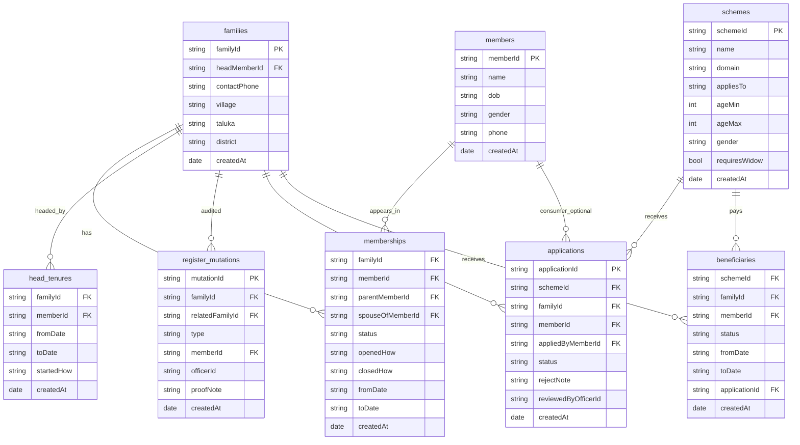

# Database Design (MongoDB)

| | |
|---|---|
| **Document** | Physical data design |
| **ID** | DB-GJ-FAM-001 |
| **Version** | 0.3 |
| **Status** | Draft — attributes complete. No application code until you command build. |
| **Date** | 20 September 2026 |
| **Related** | Logical fields: [`data-model.md`](./data-model.md) · Behaviour: [`PRD.md`](./PRD.md) · Stack: [`TECH.md`](./TECH.md) |

MongoDB physical design: collections, **every attribute**, PK/FK, indexes, uniqueness. Not application code. `relationToHead` is never a column.

---

## 1. Why Mongo, and how we host it

- Hackathon speed; documents match families/schemes.
- **Docker** so the DB is local (`docker compose up -d`).
- **Referenced collections**, not one giant family document — LEFT membership rows are the anti-fraud core.

**Engine:** MongoDB 7  
**Database:** `gj_family_id`  
**URI:** `mongodb://127.0.0.1:27017/gj_family_id`  
**Compose:** [`docker-compose.yml`](../docker-compose.yml)

---

## 2. Design rules

1. Business keys (`familyId`, `memberId`, …) are unique strings. `_id` is ObjectId (internal).
2. Life events **insert** or **update the same membership `_id`** (`status` / `toDate`). No silent rewrite of history.
3. No deletes of people or memberships.
4. Missing member reference = `""`, never `null`.
5. Calendar fields = `YYYY-MM-DD` strings. `createdAt` = BSON Date.
6. Do not store `relationToHead`.

---

## 3. ER diagram (attributes on every collection)



Every collection also has Mongo `_id` (ObjectId). It is omitted from the diagram so business keys stay readable.

| Collection | Writer | One document is |
|---|---|---|
| `families` | REGISTRY | One household |
| `members` | REGISTRY | One person for life |
| `memberships` | REGISTRY | One person in one house for a period |
| `head_tenures` | REGISTRY | One spell as head |
| `register_mutations` | REGISTRY | One walk-in edit + proof note |
| `schemes` | SCHEME_CREATOR | One announced scheme + criteria |
| `applications` | HEAD create; SCHEME_OFFICER decide | One apply |
| `beneficiaries` | SCHEME_OFFICER on approve | Who is taking the benefit |

No `users` collection in MVP. `officerId` is a string.

---

## 4. Attribute tables (source of truth)

Empty FK = `""`. Required = must be present (empty string still counts as present).

### 4.1 `families`

| Attribute | Type | Required | Key | Notes |
|---|---|---|---|---|
| `_id` | ObjectId | yes | Mongo PK | Internal |
| `familyId` | string | yes | **PK** unique | `GJ-F-########-C` |
| `headMemberId` | string | yes | **FK → members.memberId** | Current first point of contact |
| `contactPhone` | string | yes | | Head’s phone (may copy from member) |
| `village` | string | yes | | Flattened from address |
| `taluka` | string | yes | | |
| `district` | string | yes | | |
| `createdAt` | date | yes | | |
| `passwordHash` | string | yes | | bcrypt hash of the Head login password. Never store plaintext. Never return on APIs. |

### 4.2 `members`

| Attribute | Type | Required | Key | Notes |
|---|---|---|---|---|
| `_id` | ObjectId | yes | Mongo PK | |
| `memberId` | string | yes | **PK** unique | `GJ-M-##########-C`, never changes |
| `name` | string | yes | | |
| `dob` | string | yes | | `YYYY-MM-DD` |
| `gender` | string | yes | | `M` \| `F` |
| `phone` | string | yes | | `""` allowed |
| `createdAt` | date | yes | | |

No Aadhaar field.

### 4.3 `memberships`

| Attribute | Type | Required | Key | Notes |
|---|---|---|---|---|
| `_id` | ObjectId | yes | Mongo PK | Same `_id` updated on LEFT |
| `familyId` | string | yes | **FK → families** | |
| `memberId` | string | yes | **FK → members** | |
| `parentMemberId` | string | yes | **FK → members** or `""` | Father in this prototype |
| `spouseOfMemberId` | string | yes | **FK → members** or `""` | Whose wife; empty on SON/HEAD/child |
| `status` | string | yes | | `ACTIVE` \| `LEFT` |
| `openedHow` | string | yes | | **How they entered this house** (never overwritten): `FOUNDING` \| `BIRTH` \| `MARRIAGE_IN` |
| `closedHow` | string | yes | | **How they left** (only when LEFT): `""` \| `MARRIAGE_OUT` \| `DEATH` |
| `fromDate` | string | yes | | Membership started |
| `toDate` | string | yes | | Membership ended; `""` while ACTIVE |
| `createdAt` | date | yes | | |

Invariants: one ACTIVE membership per `memberId` globally; `parentMemberId` ≠ `memberId`; `spouseOfMemberId` ≠ `memberId`; one ACTIVE wife per `(familyId, spouseOfMemberId)` when spouse is not `""`.

### 4.4 `head_tenures`

| Attribute | Type | Required | Key | Notes |
|---|---|---|---|---|
| `_id` | ObjectId | yes | Mongo PK | |
| `familyId` | string | yes | **FK → families** | |
| `memberId` | string | yes | **FK → members** | Who was/is head |
| `fromDate` | string | yes | | |
| `toDate` | string | yes | | `""` = current spell (unique per family) |
| `startedHow` | string | yes | | How they became head: `FOUNDING` \| `SUCCESSION_DEATH` |
| `createdAt` | date | yes | | |

### 4.5 `register_mutations`

| Attribute | Type | Required | Key | Notes |
|---|---|---|---|---|
| `_id` | ObjectId | yes | Mongo PK | |
| `mutationId` | string | yes | **PK** unique | `GJ-X-…` |
| `familyId` | string | yes | **FK → families** | Primary house |
| `relatedFamilyId` | string | yes | **FK → families** or `""` | Other house on MARRIAGE_* |
| `type` | string | yes | | `FOUNDING` \| `BIRTH` \| `MARRIAGE_IN` \| `MARRIAGE_OUT` \| `DEATH` \| `HEAD_CHANGE` |
| `memberId` | string | yes | **FK → members** or `""` | Person affected |
| `officerId` | string | yes | | Registry officer id |
| `proofNote` | string | yes | | Min length 3; no file |
| `createdAt` | date | yes | | |

### 4.6 `schemes`

| Attribute | Type | Required | Key | Notes |
|---|---|---|---|---|
| `_id` | ObjectId | yes | Mongo PK | |
| `schemeId` | string | yes | **PK** unique | `GJ-S-…` |
| `name` | string | yes | | |
| `domain` | string | yes | | `FOOD` \| `EDUCATION` \| `PENSION` \| `WIDOW` \| other |
| `appliesTo` | string | yes | | `FAMILY` \| `MEMBER` |
| `ageMin` | int \| null | yes | | `null` = no min |
| `ageMax` | int \| null | yes | | `null` = no max |
| `gender` | string | yes | | `M` \| `F` \| `ANY` |
| `requiresWidow` | bool | yes | | Spouse membership LEFT/DEATH |
| `createdAt` | date | yes | | |

Criteria live on this document. No extra rules collection.

### 4.7 `applications`

| Attribute | Type | Required | Key | Notes |
|---|---|---|---|---|
| `_id` | ObjectId | yes | Mongo PK | |
| `applicationId` | string | yes | **PK** unique | `GJ-A-…` |
| `schemeId` | string | yes | **FK → schemes** | |
| `familyId` | string | yes | **FK → families** | |
| `memberId` | string | yes | **FK → members** or `""` | `""` if FAMILY scheme |
| `appliedByMemberId` | string | yes | **FK → members** | Head at submit |
| `status` | string | yes | | `SUBMITTED` \| `APPROVED` \| `REJECTED` |
| `rejectNote` | string | yes | | Officer text on reject; `""` otherwise |
| `reviewedByOfficerId` | string | yes | | `""` until Scheme Officer decides |
| `createdAt` | date | yes | | |

### 4.8 `beneficiaries`

| Attribute | Type | Required | Key | Notes |
|---|---|---|---|---|
| `_id` | ObjectId | yes | Mongo PK | |
| `schemeId` | string | yes | **FK → schemes** | |
| `familyId` | string | yes | **FK → families** | |
| `memberId` | string | yes | **FK → members** or `""` | `""` if FAMILY scheme |
| `status` | string | yes | | `ACTIVE` \| `STOPPED` |
| `fromDate` | string | yes | | |
| `toDate` | string | yes | | `""` while ACTIVE |
| `applicationId` | string | yes | **FK → applications** | Approval that created this |
| `createdAt` | date | yes | | |

Created only on APPROVED. Not a second place to hand out benefits.

---

## 5. Example JSON (same attributes)

### `families`

```json
{
  "familyId": "GJ-F-48291753-6",
  "headMemberId": "GJ-M-1001001001-1",
  "contactPhone": "9876543210",
  "village": "Kudasan",
  "taluka": "Gandhinagar",
  "district": "Gandhinagar",
  "createdAt": "2010-01-01T00:00:00.000Z"
}
```

### `members` (one person)

```json
{
  "memberId": "GJ-M-1001001001-1",
  "name": "Ramesh Patel",
  "dob": "1968-03-12",
  "gender": "M",
  "phone": "9876543210",
  "createdAt": "2010-01-01T00:00:00.000Z"
}
```

### `memberships` (wife of head)

```json
{
  "familyId": "GJ-F-48291753-6",
  "memberId": "GJ-M-1001001002-2",
  "parentMemberId": "",
  "spouseOfMemberId": "GJ-M-1001001001-1",
  "status": "ACTIVE",
  "openedHow": "FOUNDING",
  "closedHow": "",
  "fromDate": "2010-01-01",
  "toDate": ""
}
```

---

## 6. Indexes

Unique business keys: `families.familyId`, `members.memberId`, `schemes.schemeId`, `applications.applicationId`, `register_mutations.mutationId`.

Lookups: `{ familyId, status }` and `{ memberId, status }` on memberships; `{ familyId, spouseOfMemberId }`; applications `{ familyId, status }`, `{ status, createdAt }`; beneficiaries `{ schemeId, status }`; `families.contactPhone`; `members.name`.

**Partial unique**

```text
memberships { memberId } unique where status = ACTIVE
memberships { familyId, spouseOfMemberId } unique where status = ACTIVE and spouseOfMemberId > ""
head_tenures { familyId } unique where toDate = ""
applications { schemeId, familyId } unique where status in SUBMITTED,APPROVED and memberId = ""
applications { schemeId, memberId } unique where status in SUBMITTED,APPROVED and memberId > ""
beneficiaries { schemeId, familyId } unique where status = ACTIVE and memberId = ""
beneficiaries { schemeId, memberId } unique where status = ACTIVE and memberId > ""
```

---

## 7. Writes by event

| Event | Insert | Update (same `_id`) |
|---|---|---|
| Register family | family, members, memberships FOUNDING, head_tenure, mutation | — |
| Birth | member, membership BIRTH, mutation | — |
| Daughter marries out | membership `openedHow=MARRIAGE_IN` on husband’s family; two mutations | natal `LEFT`, `closedHow=MARRIAGE_OUT` (`openedHow` stays FOUNDING/BIRTH) |
| Son’s wife joins | member (or reuse), membership `openedHow=MARRIAGE_IN`, mutation | — |
| Death | mutation | membership `LEFT`, `closedHow=DEATH` (`openedHow` unchanged) |
| Death of head | mutations DEATH + HEAD_CHANGE, new tenure | old tenure `toDate`; `families.headMemberId`, `contactPhone` |
| Create scheme | scheme | — |
| Apply | application SUBMITTED | — |
| Approve | beneficiary ACTIVE | application APPROVED |
| Reject | — | application REJECTED + rejectNote |

No `deleteMany` / `deleteOne` on these collections.

---

## 8. Worked example — Patel household (seed)

Family `GJ-F-48291753-6` · village Kudasan · head Ramesh.

| memberId | name | dob | gender | parentMemberId | spouseOfMemberId | computed relation |
|---|---|---|---|---|---|---|
| GJ-M-1001001001-1 | Ramesh Patel | 1968-03-12 | M | `""` | `""` | HEAD |
| GJ-M-1001001002-2 | Sita Patel | 1972-07-08 | F | `""` | GJ-M-1001001001-1 | WIFE |
| GJ-M-1001001003-3 | Amit Patel | 1996-01-20 | M | GJ-M-1001001001-1 | `""` | SON |
| GJ-M-1001001004-4 | Bharat Patel | 1999-11-02 | M | GJ-M-1001001001-1 | `""` | SON |
| GJ-M-1001001005-5 | Kavita Patel | 2001-05-15 | F | GJ-M-1001001001-1 | `""` | DAUGHTER |

All five memberships: `status=ACTIVE`, `openedHow=FOUNDING`, `closedHow=""`, `fromDate=2010-01-01`, `toDate=""`.  
`head_tenures`: Ramesh, `startedHow=FOUNDING`, `toDate=""`.

**Schemes (criteria attributes)**

| schemeId (example) | name | appliesTo | ageMin | ageMax | gender | requiresWidow |
|---|---|---|---|---|---|---|
| GJ-S-FOOD-FAM-0001 | Ration (PDS) | FAMILY | null | null | ANY | false |
| GJ-S-EDU-MEM-0001 | School Scholarship | MEMBER | 6 | 25 | ANY | false |
| GJ-S-PEN-MEM-0001 | Old-age Pension | MEMBER | 60 | null | ANY | false |
| GJ-S-WID-MEM-0001 | Widow Pension | MEMBER | null | null | F | true |

**After ration apply + approve (FAMILY):** application `memberId=""`, `appliedByMemberId=GJ-M-1001001001-1`; beneficiary `memberId=""`, `status=ACTIVE`.

**After scholarship for Kavita:** application and beneficiary `memberId=GJ-M-1001001005-5`. Amit can have a **second** scholarship row (different memberId). Kavita cannot have two.

**After head death (Ramesh):** his membership LEFT/DEATH; `families.headMemberId=GJ-M-1001001003-3`; new head_tenure SUCCESSION_DEATH; Sita still ACTIVE, `spouseOfMemberId` still Ramesh → computed MOTHER; widow pension can target Sita.

---

## 9. What we do not store

- `relationToHead`
- Embedded `members[]` as the only household copy
- Proof files / GridFS
- Raw Aadhaar
- Login `users` collection (MVP). Head password lives on `families.passwordHash` (bcrypt), never plaintext.

---

## 10. Change log

| Version | Date | Change |
|---|---|---|
| 0.1 | 2026-09-20 | Collections, indexes, partial uniques, Docker. |
| 0.2 | 2026-09-20 | ER diagram with attributes; PK/FK attribute tables; flattened village/taluka/district; Patel worked example. |
| 0.3 | 2026-09-20 | Membership: replaced vague `reason` with `openedHow` + `closedHow`. Head tenure: `startedHow`. |
| 0.4 | 2026-09-20 | `families.passwordHash` (bcrypt). Plaintext Head password is not stored. |
