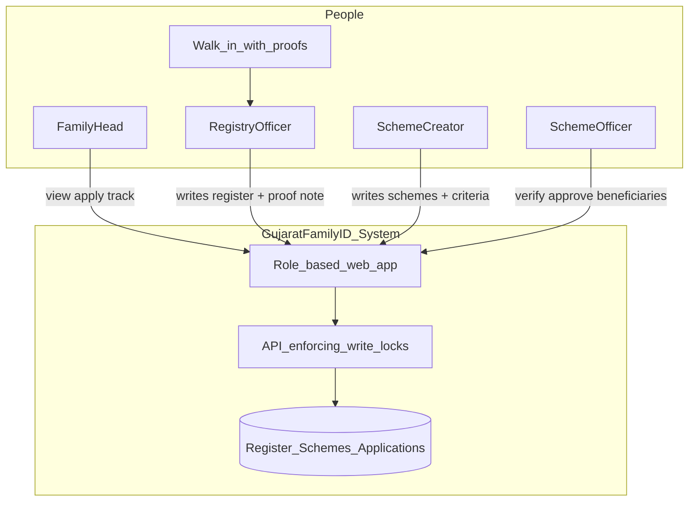
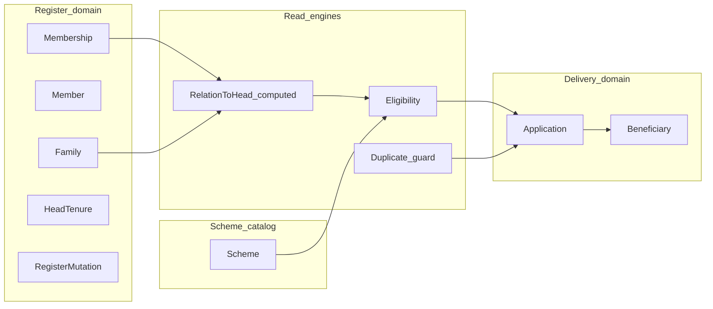
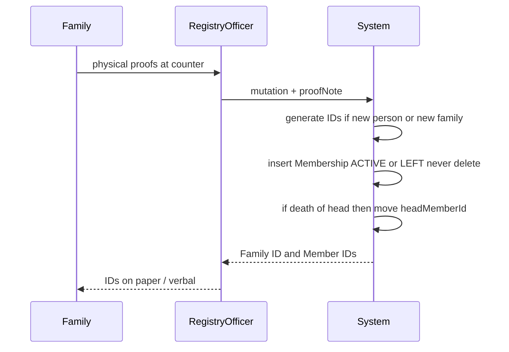
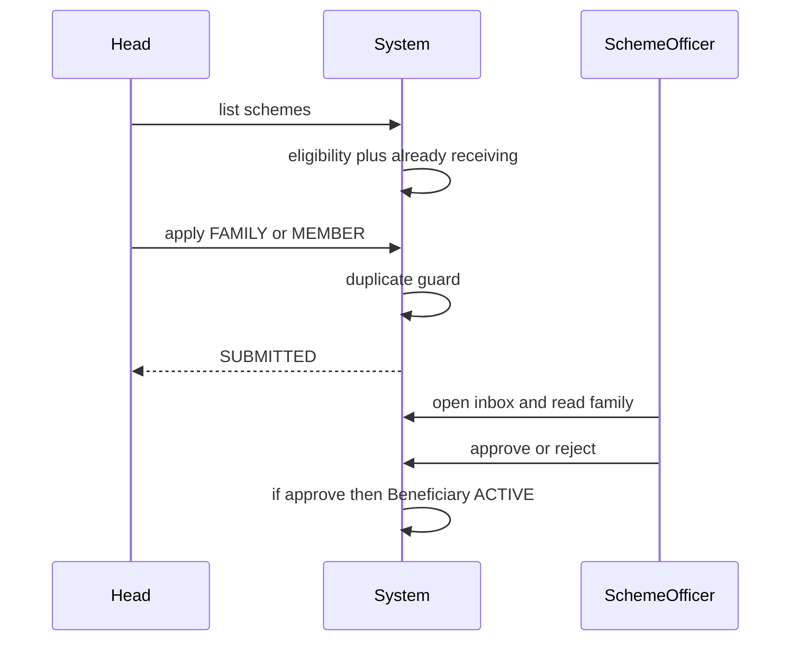

# System Design Document (SDD)

| | |
|---|---|
| **Product** | Gujarat Family ID — Beneficiary & Scheme Management |
| **Document** | System Design Document (SDD) |
| **ID** | SDD-GJ-FAM-001 |
| **Version** | 0.1 |
| **Status** | Draft — architecture and solution idea. No implementation until this and the PRD are agreed. |
| **Date** | 20 September 2026 |
| **Related** | Requirements: [`PRD.md`](./PRD.md) v0.2 · Schema: [`data-model.md`](./data-model.md) · Use cases: [`UCS.md`](./UCS.md) · APIs: [`ICD.md`](./ICD.md) · Assumptions: [`ASM.md`](./ASM.md) |

**How to use these three files**

| File | Answers | Update when |
|---|---|---|
| This SDD | Why we exist, what “good” is, the solution idea, how the system is structured | Goals, architecture, or flows change |
| [PRD](./PRD.md) | Numbered functions (`FR-…`, `BR-…`, screens) | A feature is added, changed, or removed |
| [data-model](./data-model.md) | Fields and table effects | A field is needed to implement a PRD rule |

Do not start coding until goals (this §2), requirements (PRD + this §3), solution idea (§4), and design (§5–8) are accepted.

---

## 1. Problem (one paragraph)

Gujarat runs many welfare schemes (food, scholarship, pension, widow support, and similar general categories) through separate portals and paper files. The **household is not one official object**. The same people are listed differently in each department. Citizens fill the same proofs again. Officers cannot see who is already receiving what. Duplicates and ghosts are easy; eligible families are easy to miss.

The state wants a **Family ID**: one household identity, members under it, schemes applied and monitored through that register — simpler for the family, harder to forge.

---

## 2. Goals (solid)

### 2.1 Product vision

One trusted **family register** (written only at a government counter) plus one **scheme layer** (created by government, applied by the family head, verified by a scheme officer).

Family ID is the **engine**. The **product** is: eligible apply, government sees who benefits.

### 2.2 Measurable goals

| ID | Goal | Done when |
|---|---|---|
| G-1 | Head finds schemes this house (or a member) can get, and applies without re-typing the household. | Head sees Eligible / Not eligible / Already receiving and can submit. |
| G-2 | Registry keeps the household true after **physical proofs** (new family, birth, marriage, death, new head). | Only Registry Officer can write the register; each write has officer + proof note. |
| G-3 | Government **creates** schemes with criteria (who consumes: whole family vs one person). | A new scheme with `appliesTo` + age/gender/widow rules is announceable without code. |
| G-4 | Scheme Officer **verifies** applications against the register, approve/reject, and lists who is taking the benefit. | Inbox + beneficiary list; duplicates blocked. |

### 2.3 Non-goals (this version)

- Citizens editing their own Family ID / members (safety).
- Digital “please change my family” tickets (walk-in only).
- Real Aadhaar KYC, DBT payments, DigiLocker, scanned proofs.
- Every Gujarat scheme and a full policy rule language.
- Sons forming new Family IDs (joint-family prototype).
- Per-member citizen login.

### 2.4 Design principles

1. **Person ID is forever; house membership is a period.** Marriage moves membership, not Member ID.
2. **Never delete history.** LEFT + `closedHow`, not erase (anti-forge).
3. **Applicant ≠ consumer.** Head applies; ration consumes the house; scholarship consumes one member (many members allowed).
4. **Write separation.** Registry writes people/houses. Creator writes schemes. Head writes applications. Scheme Officer writes decisions.
5. **Compute relation to head** from parent + spouse + current `headMemberId`. Do not store labels that go stale when the head dies.

---

## 3. Requirements (solid)

Detailed numbered functions live in the **PRD**. This section is the **capability contract** the design must satisfy. If a capability is missing from the PRD, add it there first.

### 3.1 Functional capabilities

| Cap | Actor | Must be able to | PRD |
|---|---|---|---|
| C-1 | Registry | Register a family; generate Family ID + Member IDs | FR-REG-01, FR-ID-* |
| C-2 | Registry | Add child; marriage in/out; death; change head — after proof note | FR-REG-02–05, FR-LE-* |
| C-3 | Registry | Look up household by Family ID / member | FR-REG-06 |
| C-4 | Head | See own ACTIVE household (read-only) | FR-H-01, FR-H-07 |
| C-5 | Head | See schemes as Eligible / Not eligible / Already receiving | FR-H-02, FR-H-03, FR-SCH-05 |
| C-6 | Head | Apply FAMILY (no member pick) or MEMBER (pick person) | FR-H-04, FR-H-05, FR-SCH-02–04 |
| C-7 | Head | Track SUBMITTED / APPROVED / REJECTED | FR-H-06 |
| C-8 | Scheme Creator | Create/edit scheme: domain, FAMILY\|MEMBER, criteria | FR-SC-01, FR-SC-02, FR-SCH-07 |
| C-9 | Scheme Officer | Inbox, verify vs register, approve/reject | FR-SO-02, FR-SO-03, FR-SO-06 |
| C-10 | Scheme Officer | See beneficiaries per scheme | FR-SO-04, FR-BEN-* |
| C-11 | Scheme Officer | Family lookup **read-only** | FR-SO-05 |
| C-12 | System | Block duplicate FAMILY `(scheme, family)` and MEMBER `(scheme, member)` | FR-APP-02–04 |

**Hard no:** Head/member writing Family, Membership, HeadTenure (BR-08, BR-11). Creator approving applications (BR-10). Officer creating schemes (BR-09) or editing the register.

### 3.2 Non-functional (prototype)

| ID | Requirement |
|---|---|
| NFR-1 | Role switcher is enough for auth (no JWT). Server still **enforces** who may write what. |
| NFR-2 | IDs are random + check digit, not serial (cannot guess the next Family ID). |
| NFR-3 | Demo data: no real Aadhaar, no government emblem. |
| NFR-4 | One officer, one family, one apply, one approve must be demoable end-to-end. |
| NFR-5 | UI: large type, simple forms, Gujarat/gov-service tone (Pravi cream/navy/blue/orange as skin — not a clone of praviresearch.com). |

---

## 4. Solution idea

**Not** “another scheme portal with a login.”  
**Not** “a family tree app.”

**The idea:** treat welfare like two systems that share one key.

1. **Civil register (Family ID)**  
   Government (Registry) is the only writer. A family is a house + a current head (first point of contact). A person is a Member ID for life. “Who lives here now” is membership with ACTIVE/LEFT. Parent pointer = whose child. Spouse pointer = whose wife. When the head dies, the Family ID stays; only the head pointer moves.

2. **Scheme layer**  
   Government (Creator) publishes a scheme: *who is the consumer — the house or a person?* plus simple criteria (age, gender, widow). The Head applies using the register (no re-entry of the household). A Scheme Officer checks the same register and approves. “Who is taking advantage” is the beneficiary list: one row per house for ration, one row per student for scholarship.

**Why this reduces fraud:** you cannot mint a second ration for the same Family ID; you cannot mint a second scholarship for the same Member ID; you cannot silently delete a dead pensioner — the row is LEFT/DEATH and still visible.

**Why this is simpler for the citizen:** one Family ID, eligibility computed for you, apply as head.

**MVP slice that proves the idea:** one walk-in family, four schemes (ration / scholarship / old-age / widow), one apply, one approve, officer sees the beneficiary. Life-event screens (birth, marriage, death) prove the register is not a static list.

---

## 5. System context



External systems (Aadhaar, DBT, Digital Gujarat, Mari Yojana) are **out of scope**. This system is a self-contained prototype of the register + scheme layer.

---

## 6. Logical architecture

Four **write domains**. Cross-domain reads are allowed; cross-domain writes are not.



| Component | Responsibility | Writer |
|---|---|---|
| Register | Identity of house and people; life events | REGISTRY |
| Scheme catalog | Announced schemes + criteria | SCHEME_CREATOR |
| Eligibility | Pure function: scheme + family/member → eligible? | none (read) |
| Duplicate guard | Unique open benefit keys | checked on Head submit and Officer approve |
| Applications | Requests | HEAD creates; SCHEME_OFFICER decides |
| Beneficiaries | Who is taking advantage | created on approve |
| UI shell | Four roles, screens per PRD §7 | — |

**Relation to head** is a **view**, not a column. Input: `headMemberId`, `parentMemberId`, `spouseOfMemberId`. Output: HEAD, WIFE, MOTHER, SON, BROTHER, DAUGHTER_IN_LAW, …

---

## 7. Core flows

### 7.1 Walk-in: register family / add child / death of head



Head is **not** in this write path.

### 7.2 Head applies; officer decides



### 7.3 FAMILY vs MEMBER consumer

| Scheme type | Application | Duplicate key | Beneficiary |
|---|---|---|---|
| FAMILY (ration) | `memberId` empty | `(schemeId, familyId)` | one row per family |
| MEMBER (scholarship, pension, widow) | `memberId` required | `(schemeId, memberId)` | one row per person; siblings allowed |

Applicant is always `appliedByMemberId` = current head.

---

## 8. Data design (summary)

Canonical fields: [`data-model.md`](./data-model.md).

**Stability**

- Member ID never changes (daughter keeps the same ID in the husband’s house).
- Family ID never changes when the head dies.
- Membership is the time-varying link.

**Pointers**

- `parentMemberId` — whose child (not on HEAD).
- `spouseOfMemberId` — whose wife (only wife / daughter-in-law rows). Empty on SON. Never father-on-son.

**Audit**

- `RegisterMutation`: type, officerId, proofNote, time.
- `HeadTenure`: who was head when.
- Application `reviewedByOfficerId`.

---

## 9. Authorization (must hold even with a role switcher)

| Action | HEAD | REGISTRY | CREATOR | SCHEME_OFFICER |
|---|---|---|---|---|
| Write Family / Member / Membership / HeadTenure / Mutation | no | yes | no | no |
| Write Scheme | no | no | yes | no |
| Create Application | yes (own family) | no | no | no |
| Approve / Reject | no | no | no | yes |
| Read own family | yes | yes | no | yes (read-only) |
| Read all families | no | yes | no | yes (read-only) |

Server must reject illegal writes. UI hiding buttons is not enough.

---

## 10. Eligibility (solution, not code)

For each announced scheme, against a family (and a member if `appliesTo = MEMBER`):

1. If already SUBMITTED/APPROVED/ACTIVE on the duplicate key → **Already receiving**.
2. Else apply criteria: ageMin/ageMax vs dob; gender; `requiresWidow` ⇒ spouse membership is LEFT/DEATH.
3. Else **Eligible** or **Not eligible**.

FAMILY schemes ignore a member picker. MEMBER schemes evaluate the **chosen** member, not the head by default.

---

## 11. Target runtime (locked in [`TECH.md`](./TECH.md); no scaffolding yet)

- Backend: Node.js + Express.
- Database: MongoDB 7 in Docker — physical design [`DB.md`](./DB.md).
- Frontend: React (JavaScript) + CSS, **Gujarat e-governance** look (Digital Gujarat / Jan Seva style). No government emblem. No Pravi marketing layout.
- Auth MVP: role switcher; server enforces writes.

---

## 12. Document map (what “solid” means for this hackathon)

```text
Problem  →  Goals G-1..G-4  →  Capabilities C-1..C-12 = PRD FRs
         →  Solution idea (§4)
         →  Architecture (§5–9)
         →  Schema (data-model.md)
         →  then implementation
```

---

## 13. Change log

| Version | Date | Change |
|---|---|---|
| 0.1 | 2026-09-20 | Initial SDD: goals, capability requirements, solution idea, context, domains, flows, auth, eligibility. Implementation deferred. |
